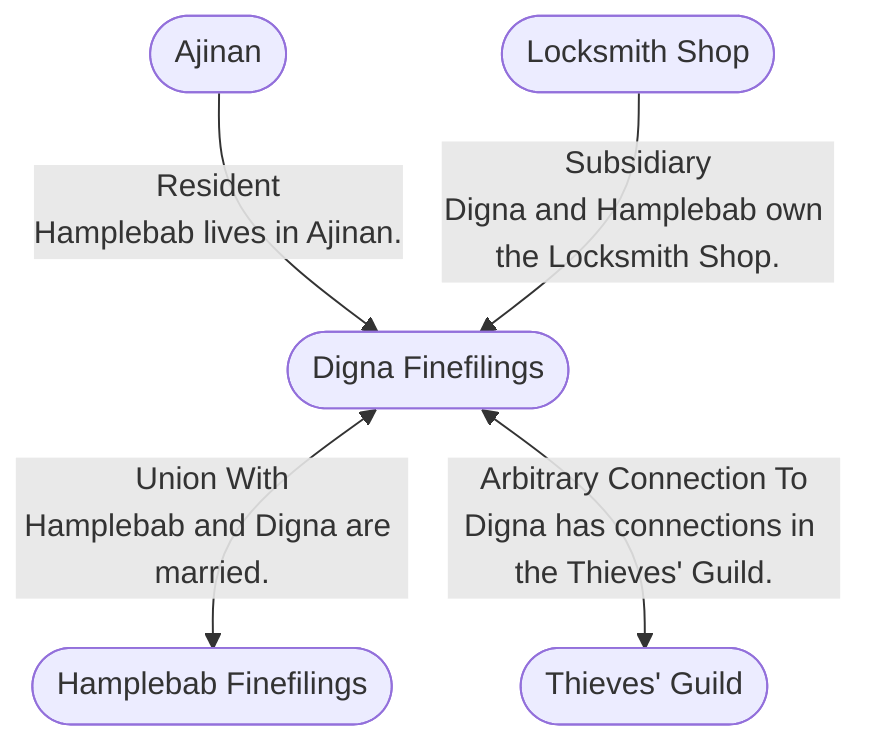

# Digna Finefilings
## Overview
---
## Connections

```mermaid
flowchart TD
Topic_3965(["Digna Finefilings"]); class Topic_3965 internal-link
Topic_4128(["Ajinan"]); class Topic_4128 internal-link
Topic_4138(["Locksmith Shop"]); class Topic_4138 internal-link
Topic_3964(["Hamplebab Finefilings"]); class Topic_3964 internal-link
Topic_4027(["Thieves' Guild"]); class Topic_4027 internal-link
Topic_4128-- "Resident
Hamplebab lives in Ajinan." -->Topic_3965
Topic_3965-- "Union With
Hamplebab and Digna are married." <-->Topic_3964
Topic_4138-- "Subsidiary
Digna and Hamplebab own the Locksmith Shop." -->Topic_3965
Topic_3965-- "Arbitrary Connection To
Digna has connections in the Thieves' Guild." <-->Topic_4027
```
%%
links: [ [[ Thieves' Guild]], [[ Hamplebab Finefilings]], [[ Locksmith Shop]], [[ Ajinan]] ]
%%

---
## Tags
#Setting-Scope/Isle-of-Kandril

