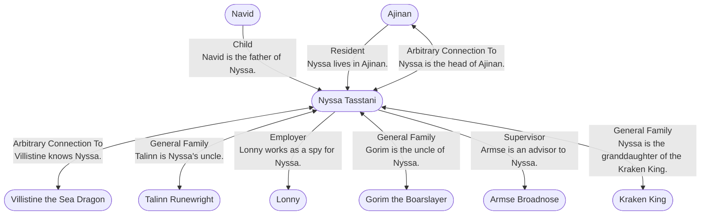

# Nyssa Tasstani
## Overview
---
## Connections

%%
links: [ [[ Villistine the Sea Dragon]], [[ Armse Broadnose]], [[ Gorim the Boarslayer]], [[ Ajinan]], [[ Kraken King]], [[ Talinn Runewright]], [[ Navid]], [[ Lonny]] ]
%%

---
## Tags
#Setting-Scope/Isle-of-Kandril

