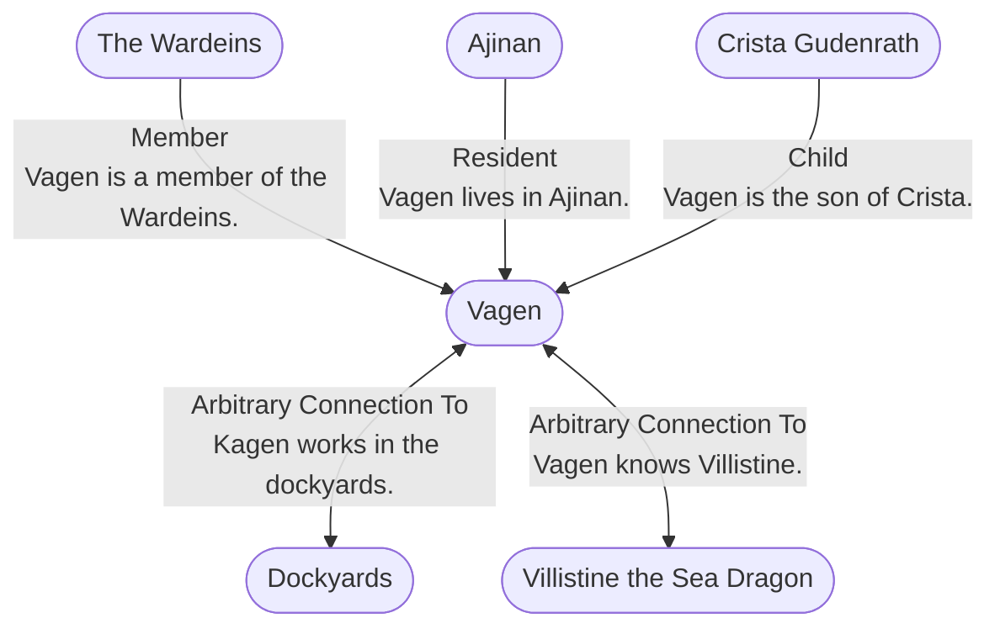

# Vagen
## Overview
---
## Connections

%%
links: [ [[ Villistine the Sea Dragon]], [[ Dockyards]], [[ Ajinan]], [[ The Wardeins]], [[ Crista Gudenrath]] ]
%%

---
## Tags
#Setting-Scope/Isle-of-Kandril

