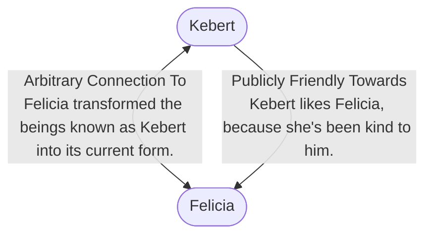

# Kebert
## Overview
---
## Connections

```mermaid
flowchart TD
Topic_4003(["Felicia"]); class Topic_4003 internal-link
Topic_3931(["Kebert"]); class Topic_3931 internal-link
Topic_3931-- "Arbitrary Connection To
Felicia transformed the beings known as Kebert into its current form." <-->Topic_4003
Topic_3931-- "Publicly Friendly Towards
Kebert likes Felicia, because she's been kind to him." -->Topic_4003
```
%%
links: [ [[ Felicia]] ]
%%

---
## Tags
#Setting-Scope/Isle-of-Kandril

