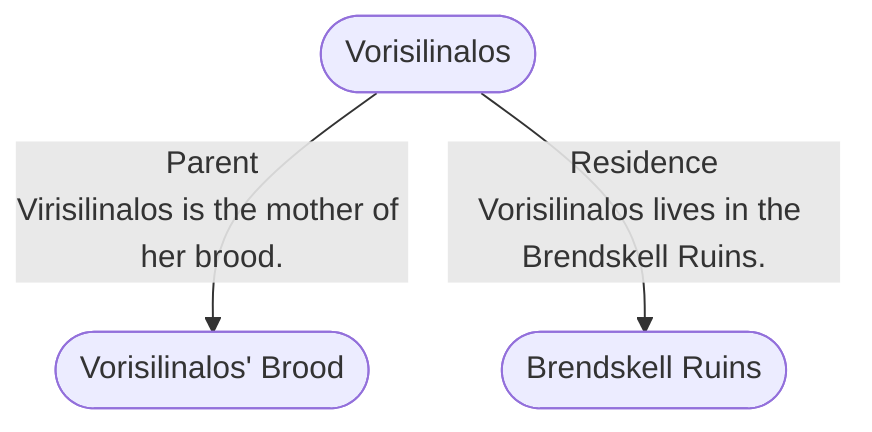

# Vorisilinalos
## Overview
---
## Connections

```mermaid
flowchart TD
Topic_4273(["Brendskell Ruins"]); class Topic_4273 internal-link
Topic_3935(["Vorisilinalos"]); class Topic_3935 internal-link
Topic_3932(["Vorisilinalos' Brood"]); class Topic_3932 internal-link
Topic_3935-- "Parent
Virisilinalos is the mother of her brood." -->Topic_3932
Topic_3935-- "Residence
Vorisilinalos lives in the Brendskell Ruins." -->Topic_4273
```
%%
links: [ [[ Vorisilinalos' Brood]], [[ Brendskell Ruins]] ]
%%

---
## Tags
#Setting-Scope/Isle-of-Kandril

