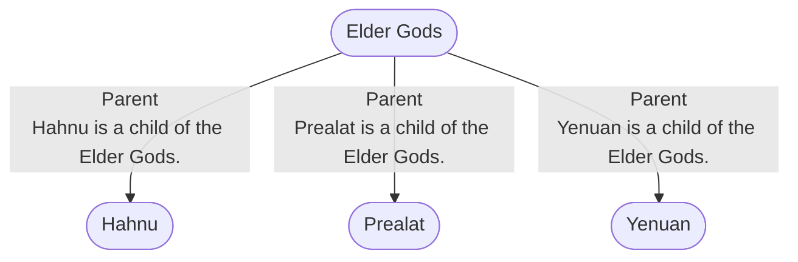

# Elder Gods
## Overview
---
## Connections

```mermaid
flowchart TD
Topic_3941(["Elder Gods"]); class Topic_3941 internal-link
Topic_3942(["Hahnu"]); class Topic_3942 internal-link
Topic_3938(["Prealat"]); class Topic_3938 internal-link
Topic_3940(["Yenuan"]); class Topic_3940 internal-link
Topic_3941-- "Parent
Hahnu is a child of the Elder Gods." -->Topic_3942
Topic_3941-- "Parent
Prealat is a child of the Elder Gods." -->Topic_3938
Topic_3941-- "Parent
Yenuan is a child of the Elder Gods." -->Topic_3940
```
%%
links: [ [[ Prealat]], [[ Hahnu]], [[ Yenuan]] ]
%%

---
## Tags
#Setting-Scope/Isle-of-Kandril

