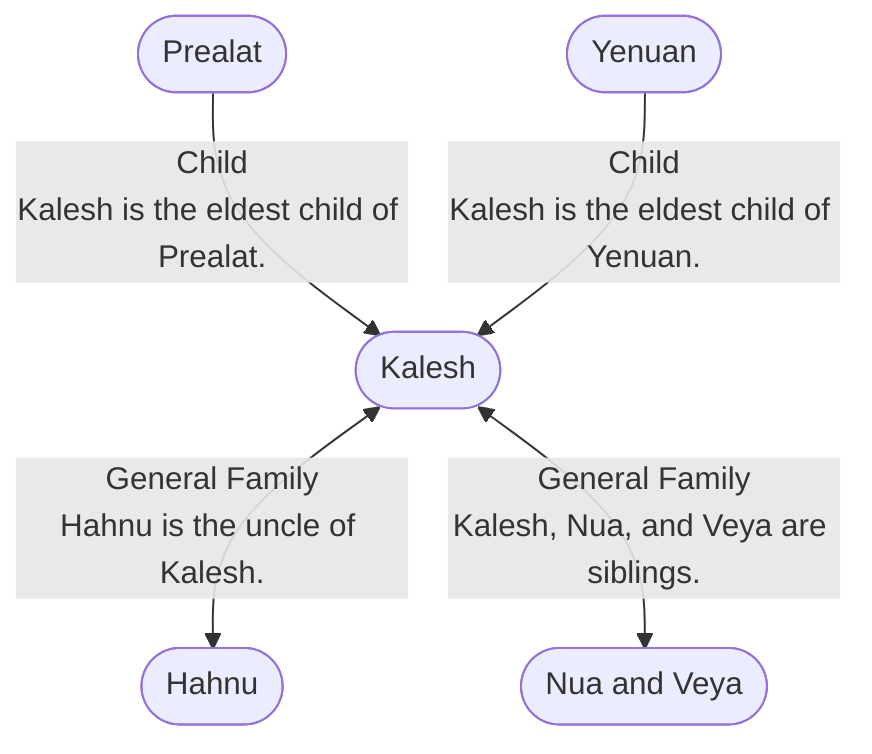

# Kalesh
## Overview
---
## Connections

```mermaid
flowchart TD
Topic_3942(["Hahnu"]); class Topic_3942 internal-link
Topic_3944(["Nua and Veya"]); class Topic_3944 internal-link
Topic_3938(["Prealat"]); class Topic_3938 internal-link
Topic_3940(["Yenuan"]); class Topic_3940 internal-link
Topic_3943(["Kalesh"]); class Topic_3943 internal-link
Topic_3938-- "Child
Kalesh is the eldest child of Prealat." -->Topic_3943
Topic_3943-- "General Family
Hahnu is the uncle of Kalesh." <-->Topic_3942
Topic_3943-- "General Family
Kalesh, Nua, and Veya are siblings." <-->Topic_3944
Topic_3940-- "Child
Kalesh is the eldest child of Yenuan." -->Topic_3943
```
%%
links: [ [[ Prealat]], [[ Nua and Veya]], [[ Hahnu]], [[ Yenuan]] ]
%%

---
## Tags
#Setting-Scope/Isle-of-Kandril

