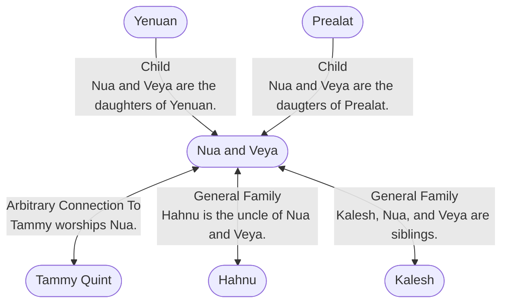

# Nua and Veya
## Overview
---
## Connections

```mermaid
flowchart TD
Topic_3973(["Tammy Quint"]); class Topic_3973 internal-link
Topic_3942(["Hahnu"]); class Topic_3942 internal-link
Topic_3944(["Nua and Veya"]); class Topic_3944 internal-link
Topic_3938(["Prealat"]); class Topic_3938 internal-link
Topic_3940(["Yenuan"]); class Topic_3940 internal-link
Topic_3943(["Kalesh"]); class Topic_3943 internal-link
Topic_3944-- "Arbitrary Connection To
Tammy worships Nua." <-->Topic_3973
Topic_3944-- "General Family
Hahnu is the uncle of Nua and Veya." <-->Topic_3942
Topic_3940-- "Child
Nua and Veya are the daughters of Yenuan." -->Topic_3944
Topic_3938-- "Child
Nua and Veya are the daugters of Prealat." -->Topic_3944
Topic_3944-- "General Family
Kalesh, Nua, and Veya are siblings." <-->Topic_3943
```
%%
links: [ [[ Prealat]], [[ Hahnu]], [[ Yenuan]], [[ Kalesh]], [[ Tammy Quint]] ]
%%

---
## Tags
#Setting-Scope/Isle-of-Kandril

