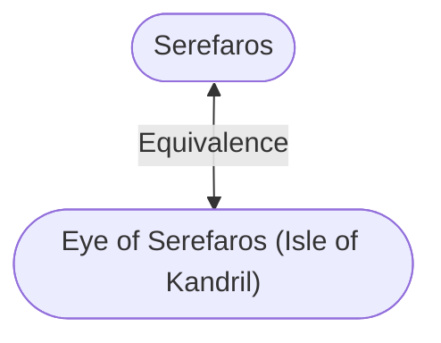

# Serefaros
## Overview
---
## Connections

```mermaid
flowchart TD
Topic_3946(["Serefaros"]); class Topic_3946 internal-link
Topic_4016(["Eye of Serefaros (Isle of Kandril)"]); class Topic_4016 internal-link
Topic_3946-- "Equivalence" <-->Topic_4016
```
%%
links: [ [[ Eye of Serefaros (Isle of Kandril)]] ]
%%

---
## Tags
#Setting-Scope/Isle-of-Kandril

