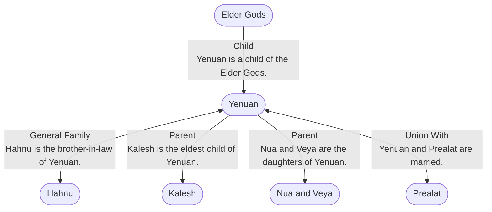

# Yenuan
## Overview
---
## Connections

```mermaid
flowchart TD
Topic_3941(["Elder Gods"]); class Topic_3941 internal-link
Topic_3942(["Hahnu"]); class Topic_3942 internal-link
Topic_3944(["Nua and Veya"]); class Topic_3944 internal-link
Topic_3938(["Prealat"]); class Topic_3938 internal-link
Topic_3940(["Yenuan"]); class Topic_3940 internal-link
Topic_3943(["Kalesh"]); class Topic_3943 internal-link
Topic_3940-- "General Family
Hahnu is the brother-in-law of Yenuan." <-->Topic_3942
Topic_3940-- "Parent
Kalesh is the eldest child of Yenuan." -->Topic_3943
Topic_3941-- "Child
Yenuan is a child of the Elder Gods." -->Topic_3940
Topic_3940-- "Parent
Nua and Veya are the daughters of Yenuan." -->Topic_3944
Topic_3940-- "Union With
Yenuan and Prealat are married." <-->Topic_3938
```
%%
links: [ [[ Prealat]], [[ Elder Gods]], [[ Nua and Veya]], [[ Hahnu]], [[ Kalesh]] ]
%%

---
## Tags
#Setting-Scope/Isle-of-Kandril

