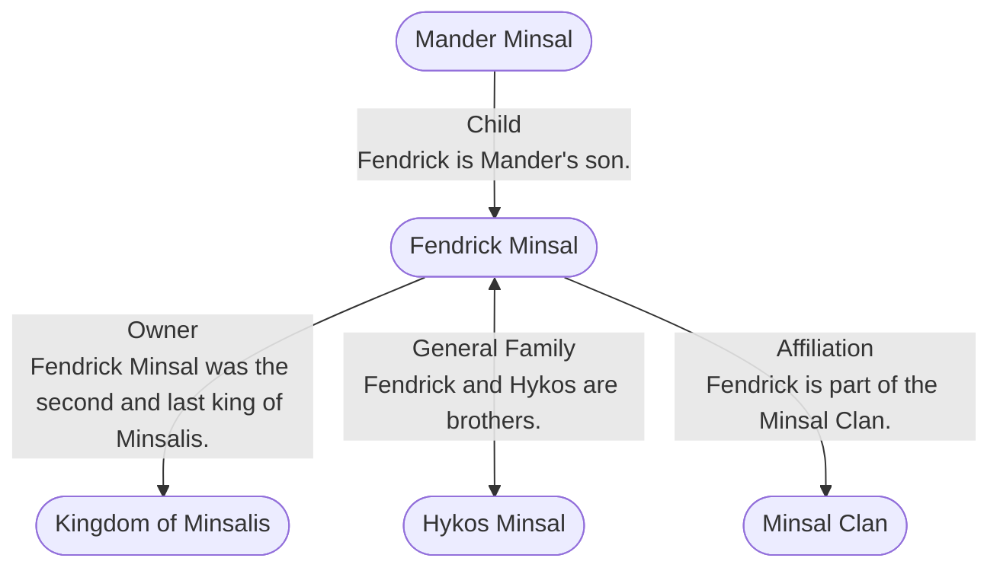

# Fendrick Minsal
## Overview
---
## Connections

```mermaid
flowchart TD
Topic_3981(["Hykos Minsal"]); class Topic_3981 internal-link
Topic_3979(["Fendrick Minsal"]); class Topic_3979 internal-link
Topic_3980(["Mander Minsal"]); class Topic_3980 internal-link
Topic_4039(["Kingdom of Minsalis"]); class Topic_4039 internal-link
Topic_4038(["Minsal Clan"]); class Topic_4038 internal-link
Topic_3980-- "Child
Fendrick is Mander's son." -->Topic_3979
Topic_3979-- "Owner
Fendrick Minsal was the second and last king of Minsalis." -->Topic_4039
Topic_3979-- "General Family
Fendrick and Hykos are brothers." <-->Topic_3981
Topic_3979-- "Affiliation
Fendrick is part of the Minsal Clan." -->Topic_4038
```
%%
links: [ [[ Mander Minsal]], [[ Kingdom of Minsalis]], [[ Hykos Minsal]], [[ Minsal Clan]] ]
%%

---
## Tags
#Setting-Scope/Isle-of-Kandril

