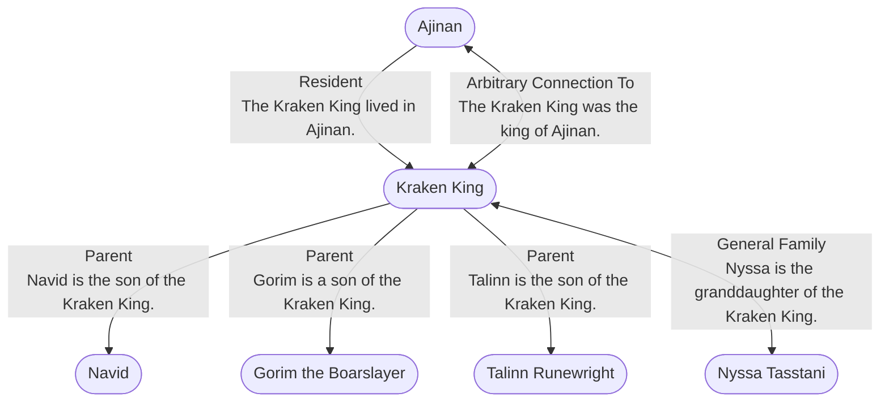

# Kraken King
## Overview
---
## Connections

%%
links: [ [[ Gorim the Boarslayer]], [[ Ajinan]], [[ Talinn Runewright]], [[ Nyssa Tasstani]], [[ Navid]] ]
%%

---
## Tags
#Setting-Scope/Isle-of-Kandril

