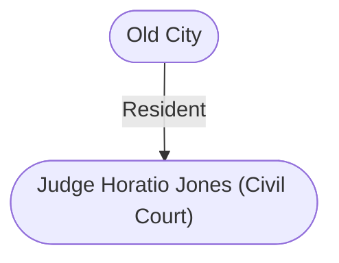

# Judge Horatio Jones (Civil Court)
## Overview
---
## Connections

```mermaid
flowchart TD
Topic_4739(["Judge Horatio Jones (Civil Court)"]); class Topic_4739 internal-link
Topic_5207(["Old City"]); class Topic_5207 internal-link
Topic_5207-- "Resident" -->Topic_4739
```
%%
links: [ [[ Old City]] ]
%%

---
## Tags
#Source/The-Pirate-s-Guide-to-Freeport

