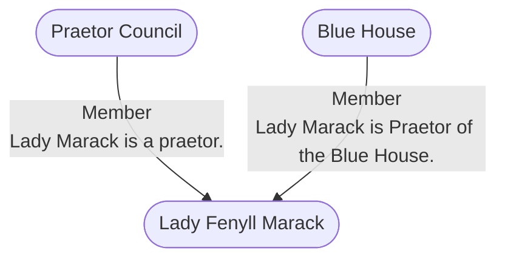

# Lady Fenyll Marack
## Overview
---
## Connections

```mermaid
flowchart TD
Topic_6442(["Blue House"]); class Topic_6442 internal-link
Topic_6579(["Praetor Council"]); class Topic_6579 internal-link
Topic_6566(["Lady Fenyll Marack"]); class Topic_6566 internal-link
Topic_6579-- "Member
Lady Marack is a praetor." -->Topic_6566
Topic_6442-- "Member
Lady Marack is Praetor of the Blue House." -->Topic_6566
```
%%
links: [ [[ Praetor Council]], [[ Blue House]] ]
%%

---
## Tags
#Story-Scope/Everyone-Lies #Story-Scope/Flesh-Fails

