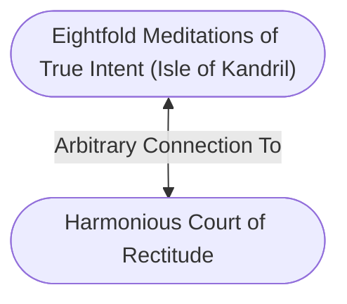

# Eightfold Meditations of True Intent (Isle of Kandril)
## Overview
---
## Connections

%%
links: [ [[ Harmonious Court of Rectitude]] ]
%%

---
## Tags
#Setting-Scope/Isle-of-Kandril #Story-Scope/Legacy-of-the-Kraken-King

