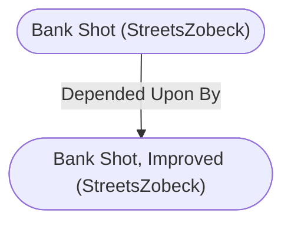

# Bank Shot, Improved (StreetsZobeck)
## Overview
---
## Connections

```mermaid
flowchart TD
Topic_6476(["Bank Shot (StreetsZobeck)"]); class Topic_6476 internal-link
Topic_6477(["Bank Shot, Improved (StreetsZobeck)"]); class Topic_6477 internal-link
Topic_6476-- "Depended Upon By" -->Topic_6477
```
%%
links: [ [[ Bank Shot (StreetsZobeck)]] ]
%%

---
## Tags
#Setting-Scope/Streets-of-Zobeck

