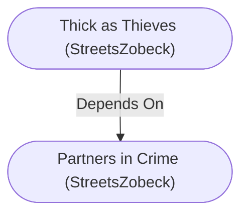

# Thick as Thieves (StreetsZobeck)
## Overview
---
## Connections

```mermaid
flowchart TD
Topic_6505(["Thick as Thieves (StreetsZobeck)"]); class Topic_6505 internal-link
Topic_6501(["Partners in Crime (StreetsZobeck)"]); class Topic_6501 internal-link
Topic_6505-- "Depends On" -->Topic_6501
```
%%
links: [ [[ Partners in Crime (StreetsZobeck)]] ]
%%

---
## Tags
#Setting-Scope/Streets-of-Zobeck

