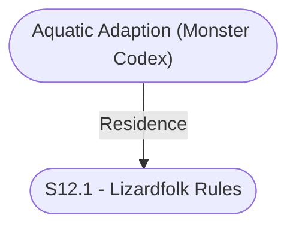

# Aquatic Adaption (Monster Codex)
## Overview
---
## Connections

```mermaid
flowchart TD
Topic_2943(["S12.1 - Lizardfolk Rules"]); class Topic_2943 internal-link
Topic_2947(["Aquatic Adaption (Monster Codex)"]); class Topic_2947 internal-link
Topic_2947-- "Residence" -->Topic_2943
```
%%
links: [ [[ S12.1 - Lizardfolk Rules]] ]
%%

