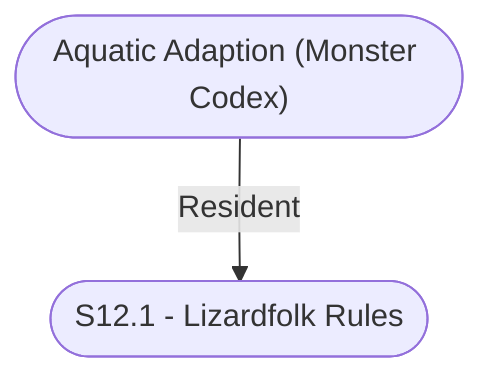

# S12.1 - Lizardfolk Rules
## Overview
---
## Governed Content
- [[Aquatic Adaption (Monster Codex)]]
- [[Dangerous Tail (Combat) (Monster Codex)]]
- [[Endothermic Touch (Monster Codex)]]
- [[Scale Spikes (Monster Codex)]]
- [[Scale Spikes, Greater (Monster Codex)]]
- [[Swift Swimmer (Monster Codex)]]

---
## Connections

%%
links: [ [[ Aquatic Adaption (Monster Codex)]] ]
%%

