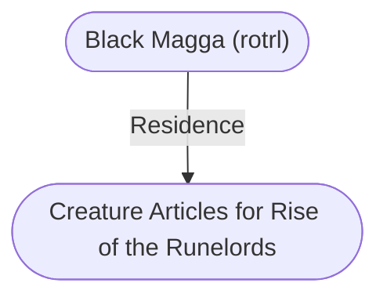

# Black Magga (rotrl)
## Overview
---
## Connections

```mermaid
flowchart TD
Topic_12375(["Creature Articles for Rise of the Runelords"]); class Topic_12375 internal-link
Topic_12376(["Black Magga (rotrl)"]); class Topic_12376 internal-link
Topic_12376-- "Residence" -->Topic_12375
```
%%
links: [ [[ Creature Articles for Rise of the Runelords]] ]
%%

---
## Tags
#Story-Scope/RotRL-Appendices

