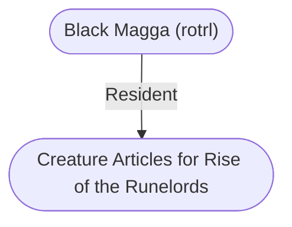

# Creature Articles for Rise of the Runelords
## Overview
---
## Governed Content
- [[Black Magga (rotrl)]]
- [[Carrionstorm (rotrl)]]
- [[Forgefiend (rotrl)]]
- [[Lamia Harridan (rotrl)]]
- [[Lamia-Kin, Hungerer (rotrl)]]
- [[Lamia-Kin, Kuchrima (rotrl)]]
- [[Runeslave (rotrl)]]
- [[Scarlet Walker (rotrl)]]
- [[Skull Ripper (rotrl)]]

---
## Connections

%%
links: [ [[ Black Magga (rotrl)]] ]
%%

---
## Tags
#Story-Scope/RotRL-Appendices

