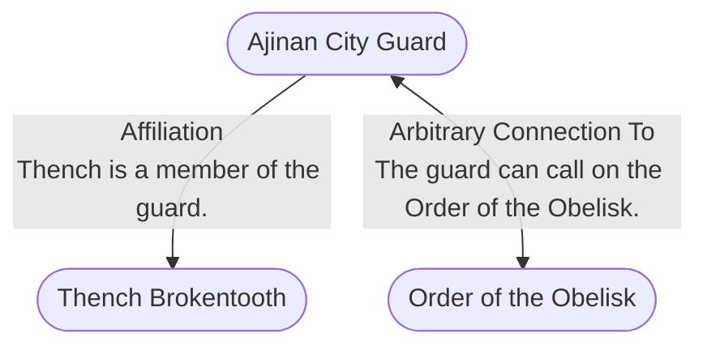

# Ajinan City Guard
## Overview
---
## Connections

```mermaid
flowchart TD
Topic_4029(["Order of the Obelisk"]); class Topic_4029 internal-link
Topic_4031(["Ajinan City Guard"]); class Topic_4031 internal-link
Topic_3958(["Thench Brokentooth"]); class Topic_3958 internal-link
Topic_4031-- "Affiliation
Thench is a member of the guard." -->Topic_3958
Topic_4031-- "Arbitrary Connection To
The guard can call on the Order of the Obelisk." <-->Topic_4029
```
%%
links: [ [[ Thench Brokentooth]], [[ Order of the Obelisk]] ]
%%

---
## Tags
#Setting-Scope/Isle-of-Kandril

