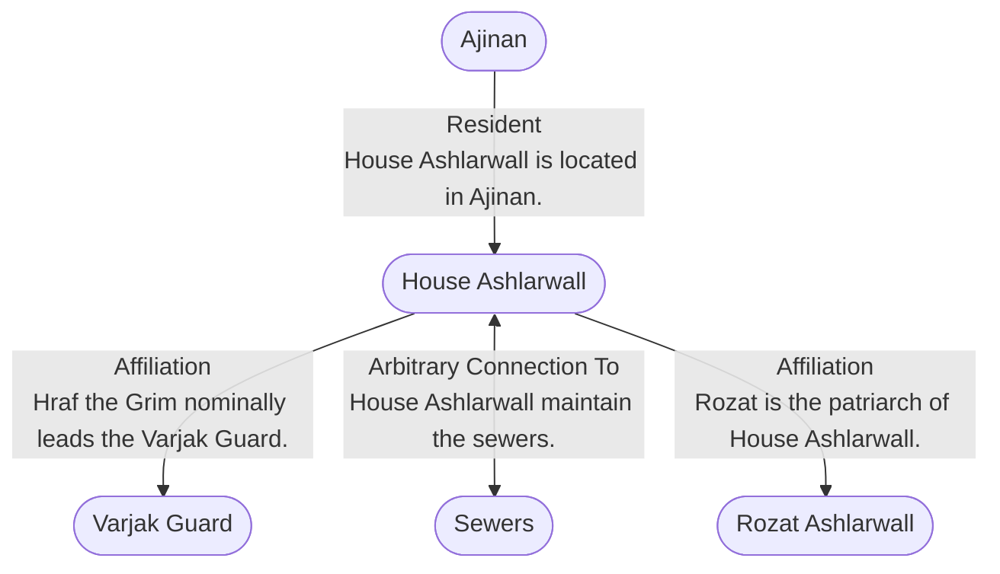

# House Ashlarwall
## Overview
---
## Connections

```mermaid
flowchart TD
Topic_4141(["Sewers"]); class Topic_4141 internal-link
Topic_4128(["Ajinan"]); class Topic_4128 internal-link
Topic_3961(["Rozat Ashlarwall"]); class Topic_3961 internal-link
Topic_4030(["House Ashlarwall"]); class Topic_4030 internal-link
Topic_4035(["Varjak Guard"]); class Topic_4035 internal-link
Topic_4128-- "Resident
House Ashlarwall is located in Ajinan." -->Topic_4030
Topic_4030-- "Affiliation
Hraf the Grim nominally leads the Varjak Guard." -->Topic_4035
Topic_4030-- "Arbitrary Connection To
House Ashlarwall maintain the sewers." <-->Topic_4141
Topic_4030-- "Affiliation
Rozat is the patriarch of House Ashlarwall." -->Topic_3961
```
%%
links: [ [[ Sewers]], [[ Ajinan]], [[ Rozat Ashlarwall]], [[ Varjak Guard]] ]
%%

---
## Tags
#Setting-Scope/Isle-of-Kandril

