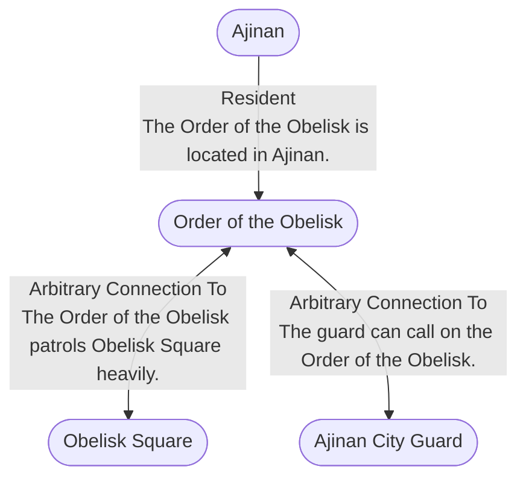

# Order of the Obelisk
## Overview
---
## Connections

```mermaid
flowchart TD
Topic_4029(["Order of the Obelisk"]); class Topic_4029 internal-link
Topic_4031(["Ajinan City Guard"]); class Topic_4031 internal-link
Topic_4128(["Ajinan"]); class Topic_4128 internal-link
Topic_4155(["Obelisk Square"]); class Topic_4155 internal-link
Topic_4128-- "Resident
The Order of the Obelisk is located in Ajinan." -->Topic_4029
Topic_4029-- "Arbitrary Connection To
The Order of the Obelisk patrols Obelisk Square heavily." <-->Topic_4155
Topic_4029-- "Arbitrary Connection To
The guard can call on the Order of the Obelisk." <-->Topic_4031
```
%%
links: [ [[ Ajinan City Guard]], [[ Obelisk Square]], [[ Ajinan]] ]
%%

---
## Tags
#Setting-Scope/Isle-of-Kandril

