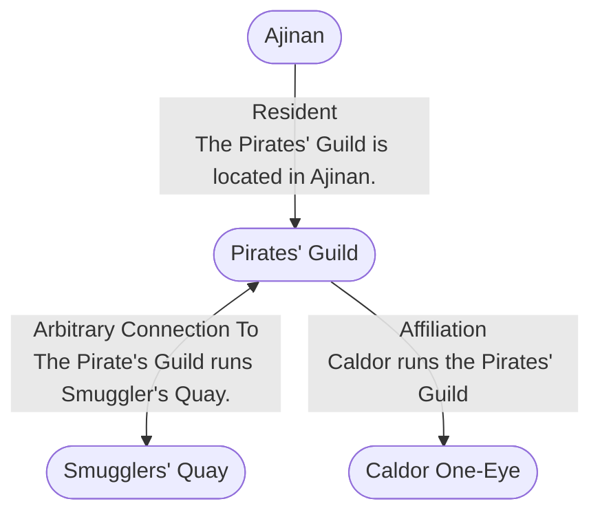

# Pirates' Guild
## Overview
---
## Connections

```mermaid
flowchart TD
Topic_4028(["Pirates' Guild"]); class Topic_4028 internal-link
Topic_4128(["Ajinan"]); class Topic_4128 internal-link
Topic_3951(["Caldor One-Eye"]); class Topic_3951 internal-link
Topic_4131(["Smugglers' Quay"]); class Topic_4131 internal-link
Topic_4028-- "Arbitrary Connection To
The Pirate's Guild runs Smuggler's Quay." <-->Topic_4131
Topic_4028-- "Affiliation
Caldor runs the Pirates' Guild" -->Topic_3951
Topic_4128-- "Resident
The Pirates' Guild is located in Ajinan." -->Topic_4028
```
%%
links: [ [[ Smugglers' Quay]], [[ Ajinan]], [[ Caldor One-Eye]] ]
%%

---
## Tags
#Setting-Scope/Isle-of-Kandril

