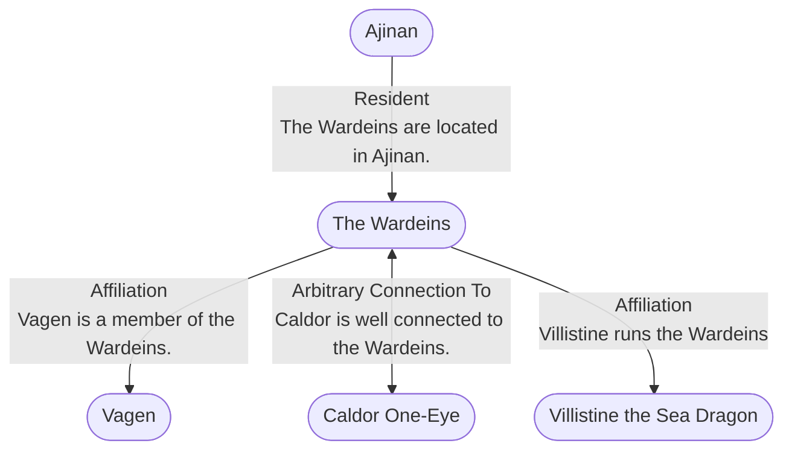

# The Wardeins
## Overview
---
## Connections

```mermaid
flowchart TD
Topic_4128(["Ajinan"]); class Topic_4128 internal-link
Topic_3951(["Caldor One-Eye"]); class Topic_3951 internal-link
Topic_3974(["Villistine the Sea Dragon"]); class Topic_3974 internal-link
Topic_3959(["Vagen"]); class Topic_3959 internal-link
Topic_4032(["The Wardeins"]); class Topic_4032 internal-link
Topic_4032-- "Affiliation
Vagen is a member of the Wardeins." -->Topic_3959
Topic_4032-- "Arbitrary Connection To
Caldor is well connected to the Wardeins." <-->Topic_3951
Topic_4128-- "Resident
The Wardeins are located in Ajinan." -->Topic_4032
Topic_4032-- "Affiliation
Villistine runs the Wardeins" -->Topic_3974
```
%%
links: [ [[ Villistine the Sea Dragon]], [[ Ajinan]], [[ Caldor One-Eye]], [[ Vagen]] ]
%%

---
## Tags
#Setting-Scope/Isle-of-Kandril

