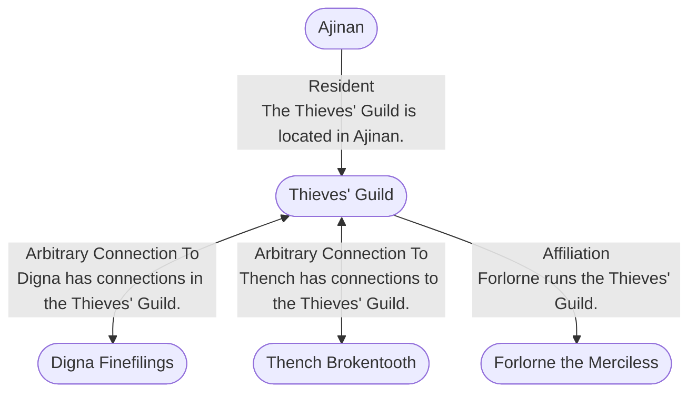

# Thieves' Guild
## Overview
---
## Connections

%%
links: [ [[ Digna Finefilings]], [[ Forlorne the Merciless]], [[ Thench Brokentooth]], [[ Ajinan]] ]
%%

---
## Tags
#Setting-Scope/Isle-of-Kandril

