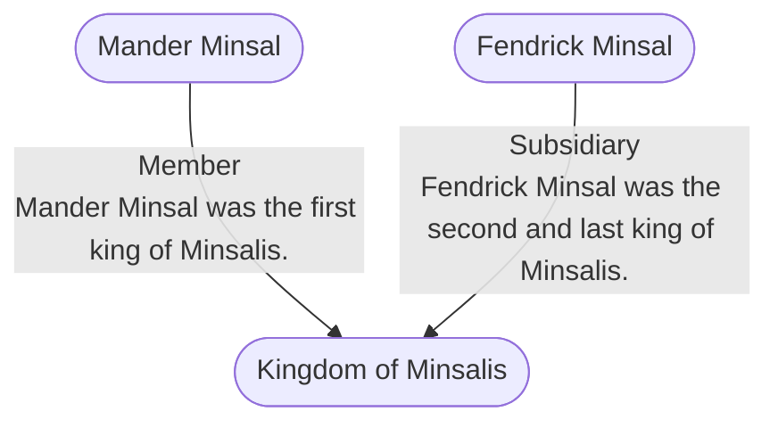

# Kingdom of Minsalis
## Overview
---
## Connections

```mermaid
flowchart TD
Topic_3979(["Fendrick Minsal"]); class Topic_3979 internal-link
Topic_3980(["Mander Minsal"]); class Topic_3980 internal-link
Topic_4039(["Kingdom of Minsalis"]); class Topic_4039 internal-link
Topic_3980-- "Member
Mander Minsal was the first king of Minsalis." -->Topic_4039
Topic_3979-- "Subsidiary
Fendrick Minsal was the second and last king of Minsalis." -->Topic_4039
```
%%
links: [ [[ Mander Minsal]], [[ Fendrick Minsal]] ]
%%

---
## Tags
#Setting-Scope/Isle-of-Kandril

