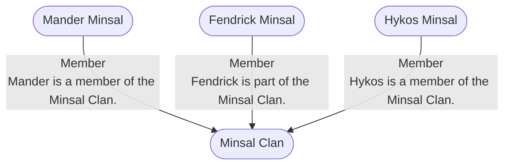

# Minsal Clan
## Overview
---
## Connections

```mermaid
flowchart TD
Topic_3981(["Hykos Minsal"]); class Topic_3981 internal-link
Topic_3979(["Fendrick Minsal"]); class Topic_3979 internal-link
Topic_3980(["Mander Minsal"]); class Topic_3980 internal-link
Topic_4038(["Minsal Clan"]); class Topic_4038 internal-link
Topic_3980-- "Member
Mander is a member of the Minsal Clan." -->Topic_4038
Topic_3979-- "Member
Fendrick is part of the Minsal Clan." -->Topic_4038
Topic_3981-- "Member
Hykos is a member of the Minsal Clan." -->Topic_4038
```
%%
links: [ [[ Mander Minsal]], [[ Hykos Minsal]], [[ Fendrick Minsal]] ]
%%

---
## Tags
#Setting-Scope/Isle-of-Kandril

