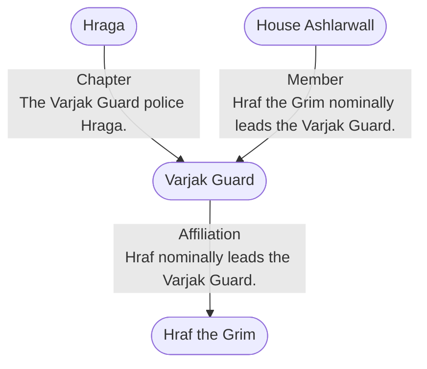

# Varjak Guard
## Overview
---
## Connections

```mermaid
flowchart TD
Topic_3984(["Hraf the Grim"]); class Topic_3984 internal-link
Topic_4192(["Hraga"]); class Topic_4192 internal-link
Topic_4030(["House Ashlarwall"]); class Topic_4030 internal-link
Topic_4035(["Varjak Guard"]); class Topic_4035 internal-link
Topic_4192-- "Chapter
The Varjak Guard police Hraga." -->Topic_4035
Topic_4030-- "Member
Hraf the Grim nominally leads the Varjak Guard." -->Topic_4035
Topic_4035-- "Affiliation
Hraf nominally leads the Varjak Guard." -->Topic_3984
```
%%
links: [ [[ House Ashlarwall]], [[ Hraga]], [[ Hraf the Grim]] ]
%%

---
## Tags
#Setting-Scope/Isle-of-Kandril

