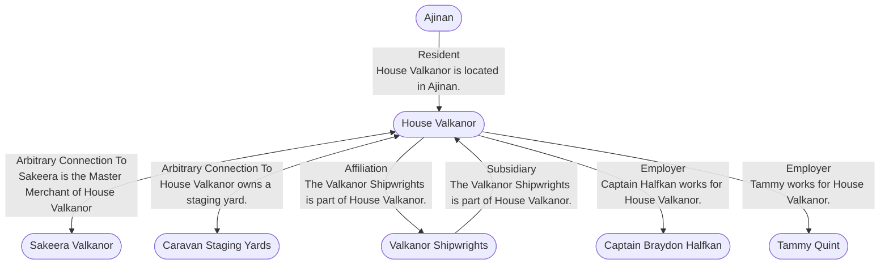

# House Valkanor
## Overview
---
## Connections

%%
links: [ [[ Caravan Staging Yards]], [[ Sakeera Valkanor]], [[ Ajinan]], [[ Valkanor Shipwrights]], [[ Tammy Quint]], [[ Captain Braydon Halfkan]] ]
%%

---
## Tags
#Setting-Scope/Isle-of-Kandril

