# Ajinan
## Overview
---
## Governed Content
- [[Ajinan Town]]
- [[Brinna the Cooper]]
- [[Caravan Staging Yards]]
- [[City Stables]]
- [[Dockyards]]
- [[Everful Tankard]]
- [[Ferry Crossings]]
- [[Fishing Docks]]
- [[Food Sources and Industry]]
- [[Fortress Heights]]
- [[House Rastinon Compound]]
- [[House Valkanor Compound]]
- [[Inns of Ajinan]]
- [[Jetty Market]]
- [[Landward Gate]]
- [[Magic Waif]]
- [[Navid's Wall]]
- [[Point of the Narwhale]]
- [[Religions in Ajinan]]
- [[Seaward Bank]]
- [[Sewers]]
- [[Shipyard]]
- [[Sieve]]
- [[Skids]]
- [[Taverns of Ajinan]]
- [[The Breaks]]
- [[Tkuska Camp]]
- [[Upriver Boathouse]]
- [[Veya's Grace]]
- [[Warehouses of Ajinan]]

---
## Connections

```mermaid
flowchart TD
Topic_3952(["Amalajack"]); class Topic_3952 internal-link
Topic_3962(["Dirttongue"]); class Topic_3962 internal-link
Topic_3969(["Haas Trevelion"]); class Topic_3969 internal-link
Topic_4028(["Pirates' Guild"]); class Topic_4028 internal-link
Topic_3955(["Knucklebones"]); class Topic_3955 internal-link
Topic_3967(["Pitney One-Eye"]); class Topic_3967 internal-link
Topic_3978(["Navid"]); class Topic_3978 internal-link
Topic_4029(["Order of the Obelisk"]); class Topic_4029 internal-link
Topic_3956(["Captain Braydon Halfkan"]); class Topic_3956 internal-link
Topic_3966(["Nyssa Tasstani"]); class Topic_3966 internal-link
Topic_3965(["Digna Finefilings"]); class Topic_3965 internal-link
Topic_3968(["Armse Broadnose"]); class Topic_3968 internal-link
Topic_3950(["Crista Gudenrath"]); class Topic_3950 internal-link
Topic_3957(["Forlorne the Merciless"]); class Topic_3957 internal-link
Topic_3953(["Kiirney Burrest"]); class Topic_3953 internal-link
Topic_3959(["Vagen"]); class Topic_3959 internal-link
Topic_4128(["Ajinan"]); class Topic_4128 internal-link
Topic_4052(["Valkanor Shipwrights"]); class Topic_4052 internal-link
Topic_4051(["Waterborne"]); class Topic_4051 internal-link
Topic_3954(["Lmutet"]); class Topic_3954 internal-link
Topic_3975(["Wentner Rastinon"]); class Topic_3975 internal-link
Topic_3970(["Loysmek the Bowyer"]); class Topic_3970 internal-link
Topic_3958(["Thench Brokentooth"]); class Topic_3958 internal-link
Topic_4027(["Thieves' Guild"]); class Topic_4027 internal-link
Topic_4049(["House Rastinon"]); class Topic_4049 internal-link
Topic_4032(["The Wardeins"]); class Topic_4032 internal-link
Topic_3977(["Kraken King"]); class Topic_3977 internal-link
Topic_3951(["Caldor One-Eye"]); class Topic_3951 internal-link
Topic_4030(["House Ashlarwall"]); class Topic_4030 internal-link
Topic_3971(["Sakeera Valkanor"]); class Topic_3971 internal-link
Topic_3963(["Zonoveth"]); class Topic_3963 internal-link
Topic_3949(["Shumiej"]); class Topic_3949 internal-link
Topic_4140(["Jeddega the Tanner"]); class Topic_4140 internal-link
Topic_3972(["Villis Rastinon"]); class Topic_3972 internal-link
Topic_4050(["House Valkanor"]); class Topic_4050 internal-link
Topic_3973(["Tammy Quint"]); class Topic_3973 internal-link
Topic_3974(["Villistine the Sea Dragon"]); class Topic_3974 internal-link
Topic_4128-- "Residence
Captain Braydon lives in Ajinan." -->Topic_3956
Topic_4128-- "Residence
Kiirney Burrest lives in Ajinan." -->Topic_3953
Topic_4128-- "Residence
The Order of the Obelisk is located in Ajinan." -->Topic_4029
Topic_4128-- "Residence
Armse Broadnose lives in Ajinan." -->Topic_3968
Topic_4128-- "Residence
The Wardeins are located in Ajinan." -->Topic_4032
Topic_4128-- "Residence
The Kraken King lived in Ajinan." -->Topic_3977
Topic_4128-- "Residence
Pitney One-Eye lives in Ajinan." -->Topic_3967
Topic_4128-- "Residence
Knucklebones lives in Ajinan." -->Topic_3955
Topic_4128-- "Residence
The Pirates' Guild is located in Ajinan." -->Topic_4028
Topic_4128-- "Residence
Loysmek lives in Ajinan." -->Topic_3970
Topic_4128-- "Residence
Valkanor Shipwrights are located in Ajinan." -->Topic_4052
Topic_4128-- "Residence
Vagen lives in Ajinan." -->Topic_3959
Topic_4128-- "Residence
Amalajack lives in Ajinan." -->Topic_3952
Topic_4128-- "Residence
Haas lives in Ajinan." -->Topic_3969
Topic_4128-- "Residence
House Ashlarwall is located in Ajinan." -->Topic_4030
Topic_4128-- "Residence
Nyssa lives in Ajinan." -->Topic_3966
Topic_4128-- "Residence
Forlorne lives in Ajinan." -->Topic_3957
Topic_4128-- "Residence
House Valkanor is located in Ajinan." -->Topic_4050
Topic_4128-- "Residence
Tammy Quint lives in Ajinan." -->Topic_3973
Topic_4128-- "Residence
House Rastinon is located in Ajinan." -->Topic_4049
Topic_4128-- "Residence
The Thieves' Guild is located in Ajinan." -->Topic_4027
Topic_4128-- "Arbitrary Connection To
Nyssa is the head of Ajinan." <-->Topic_3966
Topic_4128-- "Residence
Villistine lives in Ajinan." -->Topic_3974
Topic_4128-- "Residence
Zonoveth lives in Ajinan." -->Topic_3963
Topic_4128-- "Residence
Crista Gudenrath lives in Ajinan." -->Topic_3950
Topic_4128-- "Residence
The Waterborne are located in Ajinan." -->Topic_4051
Topic_4128-- "Arbitrary Connection To
The Kraken King was the king of Ajinan." <-->Topic_3977
Topic_4128-- "Residence
Navid lived in Ajinan." -->Topic_3978
Topic_4128-- "Residence
Thench lives in Ajinan." -->Topic_3958
Topic_4128-- "Residence
Wentner lives in Ajinan." -->Topic_3975
Topic_4128-- "Residence
Villis lives in Ajinan." -->Topic_3972
Topic_4128-- "Residence
Sakeera lives in Ajinan." -->Topic_3971
Topic_4128-- "Residence
Lmutet lives in Ajinan." -->Topic_3954
Topic_4128-- "Residence
Shumiej lives in Ajinan." -->Topic_3949
Topic_4128-- "Residence
Dirttongue lives in Ajinan." -->Topic_3962
Topic_4128-- "Residence
Hamplebab lives in Ajinan." -->Topic_3965
Topic_4128-- "Arbitrary Connection To
Navid was the king of Ajinan." <-->Topic_3978
Topic_4128-- "Residence
Caldor lives in Ajinan." -->Topic_3951
Topic_4128-- "Residence
Jeddega lives in Ajinan." -->Topic_4140
```

%%
links: [ [[ Caldor One-Eye]], [[ Dirttongue]], [[ Wentner Rastinon]], [[ House Valkanor]], [[ Tammy Quint]], [[ Waterborne]], [[ Knucklebones]], [[ Order of the Obelisk]], [[ Pitney One-Eye]], [[ Thench Brokentooth]], [[ Amalajack]], [[ Zonoveth]], [[ House Rastinon]], [[ Haas Trevelion]], [[ House Ashlarwall]], [[ Nyssa Tasstani]], [[ Navid]], [[ The Wardeins]], [[ Digna Finefilings]], [[ Forlorne the Merciless]], [[ Thieves' Guild]], [[ Kiirney Burrest]], [[ Kraken King]], [[ Crista Gudenrath]], [[ Armse Broadnose]], [[ Shumiej]], [[ Pirates' Guild]], [[ Lmutet]], [[ Captain Braydon Halfkan]], [[ Sakeera Valkanor]], [[ Loysmek the Bowyer]], [[ Vagen]], [[ Jeddega the Tanner]], [[ Villistine the Sea Dragon]], [[ Villis Rastinon]], [[ Valkanor Shipwrights]] ]
%%

---
## Tags
#Setting-Scope/Isle-of-Kandril

