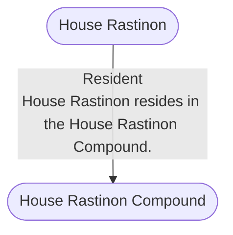

# House Rastinon Compound
## Overview
---
## Connections

```mermaid
flowchart TD
Topic_4170(["House Rastinon Compound"]); class Topic_4170 internal-link
Topic_4049(["House Rastinon"]); class Topic_4049 internal-link
Topic_4049-- "Resident
House Rastinon resides in the House Rastinon Compound." -->Topic_4170
```
%%
links: [ [[ House Rastinon]] ]
%%

---
## Tags
#Setting-Scope/Isle-of-Kandril

