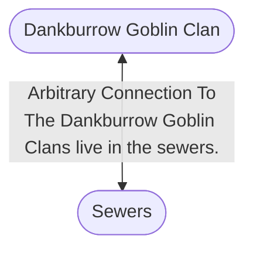

# Dankburrow Goblin Clan
## Overview
---
## Connections

```mermaid
flowchart TD
Topic_4141(["Sewers"]); class Topic_4141 internal-link
Topic_4143(["Dankburrow Goblin Clan"]); class Topic_4143 internal-link
Topic_4143-- "Arbitrary Connection To
The Dankburrow Goblin Clans live in the sewers." <-->Topic_4141
```
%%
links: [ [[ Sewers]] ]
%%

---
## Tags
#Setting-Scope/Isle-of-Kandril

