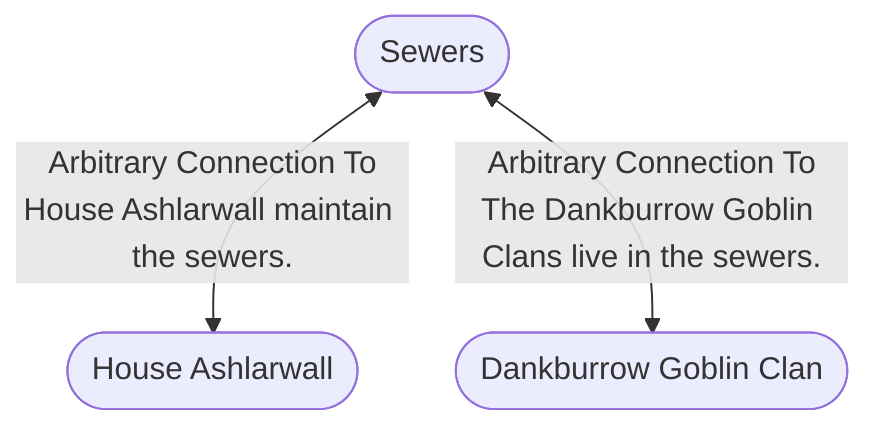

# Sewers
## Overview
---
## Governed Content
- [[Dankburrow Goblin Clan]]
- [[Oubliette]]

---
## Connections

%%
links: [ [[ Dankburrow Goblin Clan]], [[ House Ashlarwall]] ]
%%

---
## Tags
#Setting-Scope/Isle-of-Kandril

