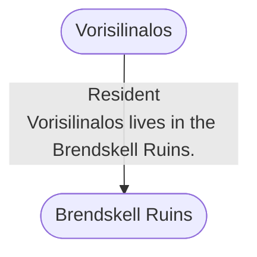

# Brendskell Ruins
## Overview
---
## Governed Content
- [[Brendskell Bell Tower]]
- [[Brendskell Hot Springs]]
- [[Brendskell Ruins Cemetery]]
- [[Brendskell Ruins Palace]]
- [[Brendskell Ruins Temple]]
- [[Dark Building]]
- [[Mirror Gardens]]
- [[Syra]]

---
## Connections

%%
links: [ [[ Vorisilinalos]] ]
%%

---
## Tags
#Setting-Scope/Isle-of-Kandril

