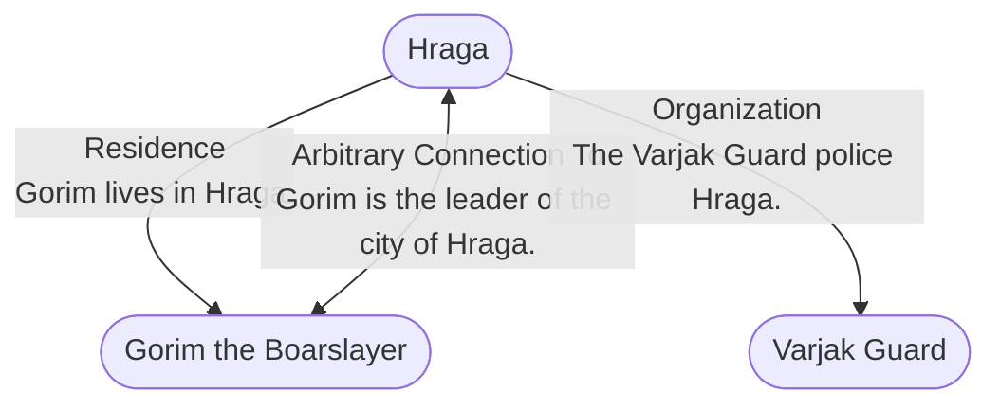

# Hraga
## Overview
---
## Governed Content
- [[Hraga Harbor]]
- [[Hraga Mines]]
- [[Law and Order in Hraga]]
- [[Lower City]]
- [[Races of Hraga]]
- [[Upper City]]

---
## Connections

%%
links: [ [[ Gorim the Boarslayer]], [[ Varjak Guard]] ]
%%

---
## Tags
#Setting-Scope/Isle-of-Kandril

