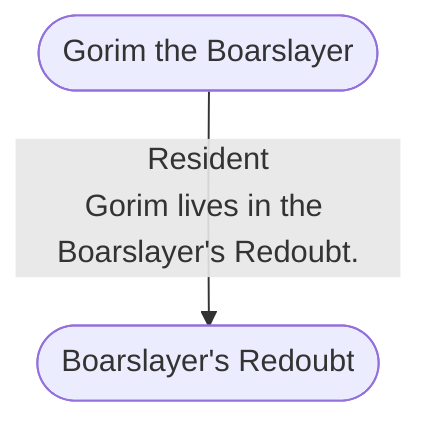

# Boarslayer's Redoubt
## Overview
---
## Connections

```mermaid
flowchart TD
Topic_3990(["Gorim the Boarslayer"]); class Topic_3990 internal-link
Topic_4202(["Boarslayer's Redoubt"]); class Topic_4202 internal-link
Topic_3990-- "Resident
Gorim lives in the Boarslayer's Redoubt." -->Topic_4202
```
%%
links: [ [[ Gorim the Boarslayer]] ]
%%

---
## Tags
#Setting-Scope/Isle-of-Kandril

