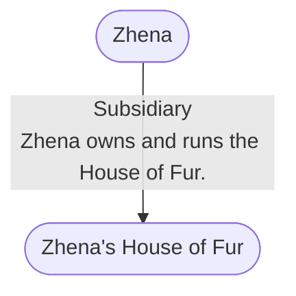

# Zhena's House of Fur
## Overview
---
## Connections

```mermaid
flowchart TD
Topic_4204(["Zhena's House of Fur"]); class Topic_4204 internal-link
Topic_3988(["Zhena"]); class Topic_3988 internal-link
Topic_3988-- "Subsidiary
Zhena owns and runs the House of Fur." -->Topic_4204
```
%%
links: [ [[ Zhena]] ]
%%

---
## Tags
#Setting-Scope/Isle-of-Kandril

