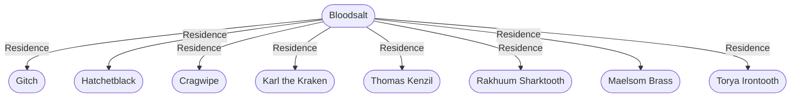

# Bloodsalt
## Overview
---
## Governed Content
- [[1 - Reclamation Project Compound]]
- [[2 - Redblade Barracks]]
- [[3 - Krom's Throat]]
- [[4 - Irontooth Enclave]]
- [[5 - Gitch's Tower]]

---
## Connections

%%
links: [ [[ Thomas Kenzil]], [[ Hatchetblack]], [[ Cragwipe]], [[ Torya Irontooth]], [[ Gitch]], [[ Rakhuum Sharktooth]], [[ Karl the Kraken]], [[ Maelsom Brass]] ]
%%

---
## Tags
#Source/The-Pirate-s-Guide-to-Freeport

