# Drac's End
## Overview
---
## Governed Content
- [[1 - Tent Town]]
- [[2 - Pawn's Shop]]
- [[3 - Freeport Institute]]
- [[4 - The Cluster]]
- [[5 - Indecipherable Scroll]]
- [[6 - SangapuTranquil Shark Protection Agency]]
- [[7 - Fang & Claw]]
- [[8 - Belle's Well]]
- [[9 - Grog Pot]]
- [[10 - The Mermaid]]
- [[11 - Scholar's Quill]]
- [[12 - Sword and Anchor]]
- [[13 - Finnegan's Books]]
- [[14 - Treacherous Plots]]
- [[15 - Dead Poets]]
- [[16 - Melted Pot]]
- [[17 - Lucky Lady]]

---
## Connections

```mermaid
flowchart TD
Topic_4755(["Omar Nkota"]); class Topic_4755 internal-link
Topic_4759(["Lucius"]); class Topic_4759 internal-link
Topic_4758(["Professor Wilmina Gertz"]); class Topic_4758 internal-link
Topic_4760(["Oskar Broadhammer"]); class Topic_4760 internal-link
Topic_5189(["Drac's End"]); class Topic_5189 internal-link
Topic_4757(["Bill Sangapulatele"]); class Topic_4757 internal-link
Topic_4762(["Egil Horne"]); class Topic_4762 internal-link
Topic_4754(["Belle Banks"]); class Topic_4754 internal-link
Topic_4756(["Sarien"]); class Topic_4756 internal-link
Topic_4761(["Mandarus Whitmire"]); class Topic_4761 internal-link
Topic_4764(["Dirk Haslinger"]); class Topic_4764 internal-link
Topic_4763(["Irene Miggins"]); class Topic_4763 internal-link
Topic_5189-- "Residence" -->Topic_4754
Topic_5189-- "Residence" -->Topic_4757
Topic_5189-- "Residence" -->Topic_4755
Topic_5189-- "Residence" -->Topic_4762
Topic_5189-- "Residence" -->Topic_4756
Topic_5189-- "Residence" -->Topic_4760
Topic_5189-- "Residence" -->Topic_4763
Topic_5189-- "Residence" -->Topic_4759
Topic_5189-- "Residence" -->Topic_4764
Topic_5189-- "Residence" -->Topic_4761
Topic_5189-- "Residence" -->Topic_4758
```

%%
links: [ [[ Sarien]], [[ Oskar Broadhammer]], [[ Egil Horne]], [[ Irene Miggins]], [[ Bill Sangapulatele]], [[ Omar Nkota]], [[ Lucius]], [[ Belle Banks]], [[ Mandarus Whitmire]], [[ Professor Wilmina Gertz]], [[ Dirk Haslinger]] ]
%%

---
## Tags
#Source/The-Pirate-s-Guide-to-Freeport

