# Eastern District
## Overview
---
## Governed Content
- [[1 - Chambers Asylum]]
- [[2 - Field of Honor]]
- [[3 - Golden Pillar Society Building]]
- [[4 - Halfling Benevolent Association Headquarters]]
- [[5 - Hellhound Social Club Headquarters]]
- [[6 - Kafe Ilkin]]
- [[7 - Strebeck's Beer Hall]]
- [[8 - Warg Company Building]]
- [[9 - Pete's]]
- [[10 - Seacat's Folly]]
- [[11 - Sea Lady's Luck]]
- [[12 - Gentleman John's]]
- [[13 - Assad's Smoke Shop]]
- [[14 - Alchemical Oddities]]
- [[15 - Edgar's Apparel]]
- [[16 - The Store]]
- [[17 - Corben's Swords]]
- [[18 - The Turtle's Shell]]
- [[19 - Herbert's Pawn]]
- [[20 - Devil's Luck]]
- [[21 - Alice's House]]
- [[22 - Old Stage]]

---
## Connections

```mermaid
flowchart TD
Topic_3283(["Jeroen Vanderzee"]); class Topic_3283 internal-link
Topic_4722(["Corbus of the Vale"]); class Topic_4722 internal-link
Topic_3276(["Orm Redleaf"]); class Topic_3276 internal-link
Topic_3277(["Bianka Altanish"]); class Topic_3277 internal-link
Topic_4724(["Nathan Strebeck"]); class Topic_4724 internal-link
Topic_5166(["Eastern District"]); class Topic_5166 internal-link
Topic_3279(["Darius Dorvin"]); class Topic_3279 internal-link
Topic_3282(["Tasin Berthain"]); class Topic_3282 internal-link
Topic_3281(["Serkan"]); class Topic_3281 internal-link
Topic_4727(["Captain Galya Timosha"]); class Topic_4727 internal-link
Topic_3285(["Cyril Berryhill"]); class Topic_3285 internal-link
Topic_3151(["Hellhounds"]); class Topic_3151 internal-link
Topic_3280(["Nalini"]); class Topic_3280 internal-link
Topic_3284(["Trask"]); class Topic_3284 internal-link
Topic_3278(["Clement Moore"]); class Topic_3278 internal-link
Topic_4726(["Driskoll Layton"]); class Topic_4726 internal-link
Topic_4725(["Ethlyn Strebeck"]); class Topic_4725 internal-link
Topic_3287(["Hassel"]); class Topic_3287 internal-link
Topic_3286(["Dunbar"]); class Topic_3286 internal-link
Topic_4723(["Arzu"]); class Topic_4723 internal-link
Topic_5166-- "Residence" -->Topic_4723
Topic_5166-- "Residence" -->Topic_3287
Topic_5166-- "Residence" -->Topic_3280
Topic_5166-- "Residence" -->Topic_3282
Topic_5166-- "Residence" -->Topic_3278
Topic_5166-- "Residence" -->Topic_3151
Topic_5166-- "Residence" -->Topic_3279
Topic_5166-- "Residence" -->Topic_3281
Topic_5166-- "Residence" -->Topic_4725
Topic_5166-- "Residence" -->Topic_4724
Topic_5166-- "Residence" -->Topic_4726
Topic_5166-- "Residence" -->Topic_3276
Topic_5166-- "Residence" -->Topic_3283
Topic_5166-- "Residence" -->Topic_3277
Topic_5166-- "Residence" -->Topic_3284
Topic_5166-- "Residence" -->Topic_3285
Topic_5166-- "Residence" -->Topic_4722
Topic_5166-- "Residence" -->Topic_4727
Topic_5166-- "Residence" -->Topic_3286
```

%%
links: [ [[ Orm Redleaf]], [[ Hellhounds]], [[ Trask]], [[ Tasin Berthain]], [[ Dunbar]], [[ Hassel]], [[ Jeroen Vanderzee]], [[ Darius Dorvin]], [[ Captain Galya Timosha]], [[ Arzu]], [[ Corbus of the Vale]], [[ Cyril Berryhill]], [[ Nathan Strebeck]], [[ Nalini]], [[ Ethlyn Strebeck]], [[ Clement Moore]], [[ Bianka Altanish]], [[ Serkan]], [[ Driskoll Layton]] ]
%%

---
## Tags
#Source/The-Pirate-s-Guide-to-Freeport

