# Merchant District
## Overview
---
## Governed Content
- [[1 - Plaza of Gold]]
- [[2 - The Marina]]
- [[3 - Merchants' Guildhouse]]
- [[4 - Gilt Clubhouse]]
- [[5 - Last Resort]]
- [[6 - Freeport Opera House]]
- [[7 - Maurice's]]
- [[8 - Maeorgan Manor]]
- [[9 - Jewelers' and Gemcutters' Guildhouse]]
- [[10 - Salon du Masque]]

---
## Connections

```mermaid
flowchart TD
Topic_4781(["Torsten Roth"]); class Topic_4781 internal-link
Topic_4789(["Walter Dalloway"]); class Topic_4789 internal-link
Topic_4779(["Wilmario"]); class Topic_4779 internal-link
Topic_4791(["Countess D'Amberville"]); class Topic_4791 internal-link
Topic_3194(["Mendor Maeorgan"]); class Topic_3194 internal-link
Topic_4790(["Vikki Tarjay"]); class Topic_4790 internal-link
Topic_4785(["Lady Sylvia Reinmark"]); class Topic_4785 internal-link
Topic_5120(["Merchant District"]); class Topic_5120 internal-link
Topic_4787(["Maurice"]); class Topic_4787 internal-link
Topic_4782(["Jessapine Holimon"]); class Topic_4782 internal-link
Topic_4788(["Portia Gallowgrange"]); class Topic_4788 internal-link
Topic_4778(["Emma Butley"]); class Topic_4778 internal-link
Topic_3183(["Dirwin Arnig"]); class Topic_3183 internal-link
Topic_4780(["Rex Nash"]); class Topic_4780 internal-link
Topic_4783(["Millant Lefevre"]); class Topic_4783 internal-link
Topic_4784(["Bobbin Brandydale"]); class Topic_4784 internal-link
Topic_4792(["Kaddaceous Serlin"]); class Topic_4792 internal-link
Topic_4786(["Rikard Burbage"]); class Topic_4786 internal-link
Topic_5120-- "Residence" -->Topic_4780
Topic_5120-- "Residence" -->Topic_4779
Topic_5120-- "Residence" -->Topic_4786
Topic_5120-- "Residence" -->Topic_4789
Topic_5120-- "Residence" -->Topic_4778
Topic_5120-- "Residence" -->Topic_4781
Topic_5120-- "Residence" -->Topic_4787
Topic_5120-- "Residence" -->Topic_4791
Topic_5120-- "Residence" -->Topic_4784
Topic_5120-- "Residence" -->Topic_3183
Topic_5120-- "Residence" -->Topic_3194
Topic_5120-- "Residence" -->Topic_4785
Topic_5120-- "Residence" -->Topic_4788
Topic_5120-- "Residence" -->Topic_4790
Topic_5120-- "Residence" -->Topic_4783
Topic_5120-- "Residence" -->Topic_4792
Topic_5120-- "Residence" -->Topic_4782
```

%%
links: [ [[ Portia Gallowgrange]], [[ Dirwin Arnig]], [[ Bobbin Brandydale]], [[ Lady Sylvia Reinmark]], [[ Kaddaceous Serlin]], [[ Wilmario]], [[ Vikki Tarjay]], [[ Maurice]], [[ Countess D'Amberville]], [[ Rex Nash]], [[ Millant Lefevre]], [[ Rikard Burbage]], [[ Walter Dalloway]], [[ Jessapine Holimon]], [[ Emma Butley]], [[ Torsten Roth]], [[ Mendor Maeorgan]] ]
%%

---
## Tags
#Source/The-Pirate-s-Guide-to-Freeport

