# Old City
## Overview
---
## Governed Content
- [[1 - Sea Lord's Palace]]
- [[2-4 - Fortress of Justice]]
- [[5 - Marquis Moon]]
- [[6 - The Baths]]
- [[7 - Argyle McGill's Curio Shop]]
- [[8 - Wizard's Guildhouse]]
- [[9 - House of Serenity]]
- [[10 - The Keelhaul]]
- [[11 - Black Rose]]
- [[12 - Devilfish]]
- [[13 - Wizard's Pouch]]
- [[14 - Gregor's Brewery]]
- [[15 - Sunken Treasures]]
- [[16 - Tirwin's Fine Clothing]]
- [[17 - The Matchlock]]
- [[18 - Mickey's Pleasures]]
- [[19 - The Gentleman's Club]]
- [[Tasovar's Shop]]

---
## Connections

```mermaid
flowchart TD
Topic_4733(["Sergeant Ruben Carsdale"]); class Topic_4733 internal-link
Topic_4744(["Ficca"]); class Topic_4744 internal-link
Topic_4732(["Captain Amos Shent"]); class Topic_4732 internal-link
Topic_4739(["Judge Horatio Jones (Civil Court)"]); class Topic_4739 internal-link
Topic_4746(["Argyle McGill"]); class Topic_4746 internal-link
Topic_4743(["Alten Redfeld"]); class Topic_4743 internal-link
Topic_4734(["Captain Emery Shent"]); class Topic_4734 internal-link
Topic_3200(["Mister Wednesday"]); class Topic_3200 internal-link
Topic_5207(["Old City"]); class Topic_5207 internal-link
Topic_4745(["Krovz"]); class Topic_4745 internal-link
Topic_4748(["Sylvia Rathrow"]); class Topic_4748 internal-link
Topic_4749(["Lexi"]); class Topic_4749 internal-link
Topic_4750(["Captain Nigel Trent"]); class Topic_4750 internal-link
Topic_4731(["Carissa Fenwick"]); class Topic_4731 internal-link
Topic_4738(["Judge Alistair Strummer (Civil Court)"]); class Topic_4738 internal-link
Topic_4735(["Judge Alfred Ubu (Criminal Court)"]); class Topic_4735 internal-link
Topic_4736(["Judge Shamus McGowan (Criminal Court)"]); class Topic_4736 internal-link
Topic_4747(["Thorgrim"]); class Topic_4747 internal-link
Topic_4737(["Judge Charlene Rhodes (Civil Court)"]); class Topic_4737 internal-link
Topic_4752(["Uri Tasovar"]); class Topic_4752 internal-link
Topic_4740(["Judge Frederick Drent (Criminal Court)"]); class Topic_4740 internal-link
Topic_4730(["Thomas Fleetfoot"]); class Topic_4730 internal-link
Topic_4741(["Marius Edgel"]); class Topic_4741 internal-link
Topic_4742(["Greminy Greeg"]); class Topic_4742 internal-link
Topic_5207-- "Residence" -->Topic_4739
Topic_5207-- "Residence" -->Topic_4745
Topic_5207-- "Residence" -->Topic_4747
Topic_5207-- "Residence" -->Topic_4733
Topic_5207-- "Residence" -->Topic_4736
Topic_5207-- "Residence" -->Topic_4738
Topic_5207-- "Residence" -->Topic_4744
Topic_5207-- "Residence" -->Topic_4746
Topic_5207-- "Residence" -->Topic_4740
Topic_5207-- "Residence" -->Topic_4749
Topic_5207-- "Residence" -->Topic_4735
Topic_5207-- "Residence" -->Topic_4730
Topic_5207-- "Residence" -->Topic_4731
Topic_5207-- "Residence" -->Topic_4748
Topic_5207-- "Residence" -->Topic_4742
Topic_5207-- "Residence" -->Topic_4743
Topic_5207-- "Residence" -->Topic_3200
Topic_5207-- "Residence" -->Topic_4732
Topic_5207-- "Residence" -->Topic_4737
Topic_5207-- "Residence" -->Topic_4741
Topic_5207-- "Residence" -->Topic_4750
Topic_5207-- "Residence" -->Topic_4752
Topic_5207-- "Residence" -->Topic_4734
```

%%
links: [ [[ Judge Horatio Jones (Civil Court)]], [[ Marius Edgel]], [[ Thorgrim]], [[ Captain Amos Shent]], [[ Sylvia Rathrow]], [[ Thomas Fleetfoot]], [[ Lexi]], [[ Judge Charlene Rhodes (Civil Court)]], [[ Captain Emery Shent]], [[ Mister Wednesday]], [[ Argyle McGill]], [[ Judge Alistair Strummer (Civil Court)]], [[ Sergeant Ruben Carsdale]], [[ Judge Frederick Drent (Criminal Court)]], [[ Krovz]], [[ Judge Shamus McGowan (Criminal Court)]], [[ Judge Alfred Ubu (Criminal Court)]], [[ Ficca]], [[ Greminy Greeg]], [[ Carissa Fenwick]], [[ Captain Nigel Trent]], [[ Alten Redfeld]], [[ Uri Tasovar]] ]
%%

---
## Tags
#Source/The-Pirate-s-Guide-to-Freeport

