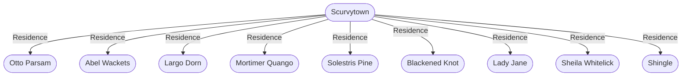

# Scurvytown
## Overview
---
## Governed Content
- [[1 - Dreaming Street]]
- [[2 - The Dead Pelican]]
- [[3 - Otto's Blades & Baldrics]]
- [[4 - Freeport Fishery & Market]]
- [[5 - Mouth of Hell]]
- [[6 - The Chumhouse]]
- [[7 - The Old Whore]]
- [[8 - Fish Stew]]
- [[9 - Dread's Place]]
- [[10 - Heave Ho]]
- [[11 - Razor's Edge]]
- [[12 - Kill Shop]]
- [[13 - Plunder]]
- [[14 - Jeffers Goods]]
- [[15 - The Grunt]]
- [[16 - Horus's Heap]]
- [[17 - The Junk Store]]
- [[18 - Blood Den]]

---
## Connections

%%
links: [ [[ Blackened Knot]], [[ Otto Parsam]], [[ Shingle]], [[ Solestris Pine]], [[ Sheila Whitelick]], [[ Lady Jane]], [[ Largo Dorn]], [[ Mortimer Quango]], [[ Abel Wackets]] ]
%%

---
## Tags
#Source/The-Pirate-s-Guide-to-Freeport

