# Temple District
## Overview
---
## Governed Content
- [[1 - Fool's Market]]
- [[2 - Temple of the God of Knowledge]]
- [[3 - Temple of the God of War]]
- [[4 - Temple of the God of the Sea]]
- [[5 - Godshop]]
- [[6 - Temple of the God of Pirates]]
- [[7 - Temple of Death]]
- [[8 - Shrine of the Magic God]]
- [[9 - God of Roads]]
- [[10 - God of Strength]]
- [[Other Gods]]

---
## Connections

```mermaid
flowchart TD
Topic_4773(["Sister Regina"]); class Topic_4773 internal-link
Topic_4766(["Peg-Leg Peligro"]); class Topic_4766 internal-link
Topic_4775(["Talbous Mog"]); class Topic_4775 internal-link
Topic_3187(["Sister Gwendolyn"]); class Topic_3187 internal-link
Topic_4774(["Pastor Wasten"]); class Topic_4774 internal-link
Topic_4776(["Brother Giorgie"]); class Topic_4776 internal-link
Topic_5108(["Temple District"]); class Topic_5108 internal-link
Topic_4770(["High Priest Egil"]); class Topic_4770 internal-link
Topic_4768(["Mother Lorilee"]); class Topic_4768 internal-link
Topic_4769(["Father Cadiccen"]); class Topic_4769 internal-link
Topic_4772(["Gamey Rind"]); class Topic_4772 internal-link
Topic_4771(["Brother Ansel"]); class Topic_4771 internal-link
Topic_4767(["Wilford Vinely"]); class Topic_4767 internal-link
Topic_5108-- "Residence" -->Topic_4772
Topic_5108-- "Arbitrary Connection To" <-->Topic_4769
Topic_5108-- "Residence" -->Topic_4776
Topic_5108-- "Residence" -->Topic_4770
Topic_5108-- "Residence" -->Topic_4774
Topic_5108-- "Residence" -->Topic_4766
Topic_5108-- "Residence" -->Topic_4775
Topic_5108-- "Residence" -->Topic_4768
Topic_5108-- "Residence" -->Topic_4773
Topic_5108-- "Residence" -->Topic_3187
Topic_5108-- "Residence" -->Topic_4767
Topic_5108-- "Residence" -->Topic_4771
```

%%
links: [ [[ Father Cadiccen]], [[ Peg-Leg Peligro]], [[ Mother Lorilee]], [[ Gamey Rind]], [[ Talbous Mog]], [[ Brother Ansel]], [[ Sister Gwendolyn]], [[ Sister Regina]], [[ Pastor Wasten]], [[ Brother Giorgie]], [[ Wilford Vinely]], [[ High Priest Egil]] ]
%%

---
## Tags
#Source/The-Pirate-s-Guide-to-Freeport

