# The Docks
## Overview
---
## Governed Content
- [[1 - Longshoremen's Union]]
- [[2 - Seaside Market]]
- [[3 - Black Gull]]
- [[4 - The Rusty Hook]]
- [[5 - Society of Lobstermen]]
- [[6 - Shipping News]]
- [[7 - The One Ring]]
- [[8 - The Broken Mug]]
- [[9 - Diving Fin]]
- [[10 - Star of the Sea Building]]
- [[11 - The Dented Helm]]
- [[12 - The Lost Lass]]
- [[13 - Cracked Pot]]
- [[14 - Kergen's Kradle]]
- [[15 - Doxies Lap]]
- [[16 - Bilge Rat]]
- [[17 - Urian's Forge]]
- [[18 - Hidden Hide]]
- [[19 - Rose Alley]]
- [[20 - Bliss]]
- [[21 - Eddies]]
- [[22 - Honey Pot]]

---
## Connections

```mermaid
flowchart TD
Topic_3254(["Garek"]); class Topic_3254 internal-link
Topic_3238(["Pious Pete"]); class Topic_3238 internal-link
Topic_3232(["Poppy Bragg"]); class Topic_3232 internal-link
Topic_3241(["M.F."]); class Topic_3241 internal-link
Topic_5085(["The Docks"]); class Topic_5085 internal-link
Topic_3243(["Poul Reiner"]); class Topic_3243 internal-link
Topic_3237(["Nevtalathien"]); class Topic_3237 internal-link
Topic_3235(["Halkos Tremir"]); class Topic_3235 internal-link
Topic_3247(["Jonas Virden"]); class Topic_3247 internal-link
Topic_3239(["Dill Mackey"]); class Topic_3239 internal-link
Topic_3234(["Brunnor Wallingston"]); class Topic_3234 internal-link
Topic_3251(["Dreiden Simmerswell"]); class Topic_3251 internal-link
Topic_3256(["Slick"]); class Topic_3256 internal-link
Topic_3236(["Jaminy Swift"]); class Topic_3236 internal-link
Topic_3240(["Buster"]); class Topic_3240 internal-link
Topic_3244(["C.Q. Calame"]); class Topic_3244 internal-link
Topic_3255(["Watch Captain Cadawar Creed"]); class Topic_3255 internal-link
Topic_3233(["Emaya Passos"]); class Topic_3233 internal-link
Topic_3252(["Gringa"]); class Topic_3252 internal-link
Topic_3249(["Dakarta Gringsson"]); class Topic_3249 internal-link
Topic_3246(["Dahn Rey"]); class Topic_3246 internal-link
Topic_3253(["Meredian Clozet"]); class Topic_3253 internal-link
Topic_3248(["Ragnar"]); class Topic_3248 internal-link
Topic_3250(["Captain Morgan Baumann"]); class Topic_3250 internal-link
Topic_3242(["Karl Wine"]); class Topic_3242 internal-link
Topic_3245(["Angelo Stampfel"]); class Topic_3245 internal-link
Topic_5085-- "Residence" -->Topic_3239
Topic_5085-- "Residence" -->Topic_3246
Topic_5085-- "Residence" -->Topic_3256
Topic_5085-- "Residence" -->Topic_3249
Topic_5085-- "Residence" -->Topic_3247
Topic_5085-- "Residence" -->Topic_3252
Topic_5085-- "Residence" -->Topic_3241
Topic_5085-- "Residence" -->Topic_3235
Topic_5085-- "Residence" -->Topic_3234
Topic_5085-- "Residence" -->Topic_3253
Topic_5085-- "Residence" -->Topic_3233
Topic_5085-- "Residence" -->Topic_3237
Topic_5085-- "Residence" -->Topic_3254
Topic_5085-- "Residence" -->Topic_3248
Topic_5085-- "Residence" -->Topic_3250
Topic_5085-- "Residence" -->Topic_3245
Topic_5085-- "Residence" -->Topic_3242
Topic_5085-- "Residence" -->Topic_3238
Topic_5085-- "Residence" -->Topic_3243
Topic_5085-- "Residence" -->Topic_3236
Topic_5085-- "Residence" -->Topic_3244
Topic_5085-- "Residence" -->Topic_3240
Topic_5085-- "Residence" -->Topic_3232
Topic_5085-- "Residence" -->Topic_3251
Topic_5085-- "Residence" -->Topic_3255
```

%%
links: [ [[ Jaminy Swift]], [[ Slick]], [[ C.Q. Calame]], [[ Brunnor Wallingston]], [[ Buster]], [[ Karl Wine]], [[ Jonas Virden]], [[ Poppy Bragg]], [[ Watch Captain Cadawar Creed]], [[ Poul Reiner]], [[ Pious Pete]], [[ Captain Morgan Baumann]], [[ Halkos Tremir]], [[ Ragnar]], [[ Emaya Passos]], [[ Garek]], [[ Dill Mackey]], [[ Angelo Stampfel]], [[ M.F.]], [[ Nevtalathien]], [[ Dakarta Gringsson]], [[ Gringa]], [[ Dreiden Simmerswell]], [[ Dahn Rey]], [[ Meredian Clozet]] ]
%%

---
## Tags
#Source/The-Pirate-s-Guide-to-Freeport

