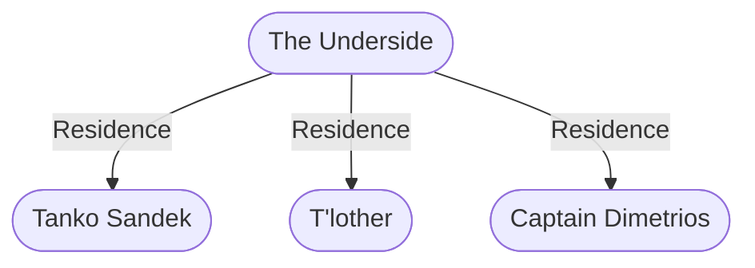

# The Underside
## Overview
---
## Governed Content
- [[City of Sewers]]
- [[Dwellers Below]]
- [[Temple of the Unspeakable One]]
- [[Temple of Yig]]
- [[Things in the Sewers]]

---
## Connections

%%
links: [ [[ Captain Dimetrios]], [[ T'lother]], [[ Tanko Sandek]] ]
%%

---
## Tags
#Source/The-Pirate-s-Guide-to-Freeport

