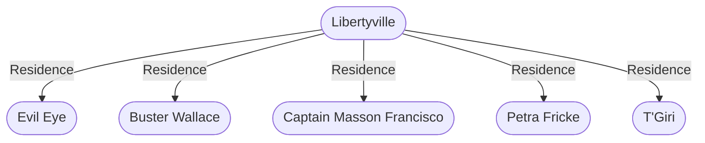

# Libertyville
## Overview
---
## Governed Content
- [[Funded by Freeport]]
- [[Liberty Movement]]

---
## Connections

%%
links: [ [[ T'Giri]], [[ Petra Fricke]], [[ Evil Eye]], [[ Buster Wallace]], [[ Captain Masson Francisco]] ]
%%

---
## Tags
#Source/The-Pirate-s-Guide-to-Freeport

