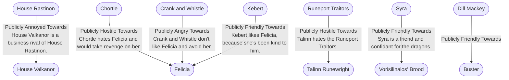

```mermaid
flowchart TD
Topic_4001(["Talinn Runewright"]); class Topic_4001 internal-link
Topic_4049(["House Rastinon"]); class Topic_4049 internal-link
Topic_3929(["Chortle"]); class Topic_3929 internal-link
Topic_4024(["Runeport Traitors"]); class Topic_4024 internal-link
Topic_3930(["Crank and Whistle"]); class Topic_3930 internal-link
Topic_4278(["Syra"]); class Topic_4278 internal-link
Topic_3239(["Dill Mackey"]); class Topic_3239 internal-link
Topic_3932(["Vorisilinalos' Brood"]); class Topic_3932 internal-link
Topic_4003(["Felicia"]); class Topic_4003 internal-link
Topic_4050(["House Valkanor"]); class Topic_4050 internal-link
Topic_3240(["Buster"]); class Topic_3240 internal-link
Topic_3931(["Kebert"]); class Topic_3931 internal-link
Topic_3239-- "Publicly Friendly Towards" -->Topic_3240
Topic_4049-- "Publicly Annoyed Towards
House Valkanor is a business rival of House Rastinon." -->Topic_4050
Topic_3929-- "Publicly Hostile Towards
Chortle hates Felicia and would take revenge on her." -->Topic_4003
Topic_4024-- "Publicly Hostile Towards
Talinn hates the Runeport Traitors." -->Topic_4001
Topic_3930-- "Publicly Angry Towards
Crank and Whistle don't like Felicia and avoid her." -->Topic_4003
Topic_4278-- "Publicly Friendly Towards
Syra is a friend and confidant for the dragons." -->Topic_3932
Topic_3931-- "Publicly Friendly Towards
Kebert likes Felicia, because she's been kind to him." -->Topic_4003
```
